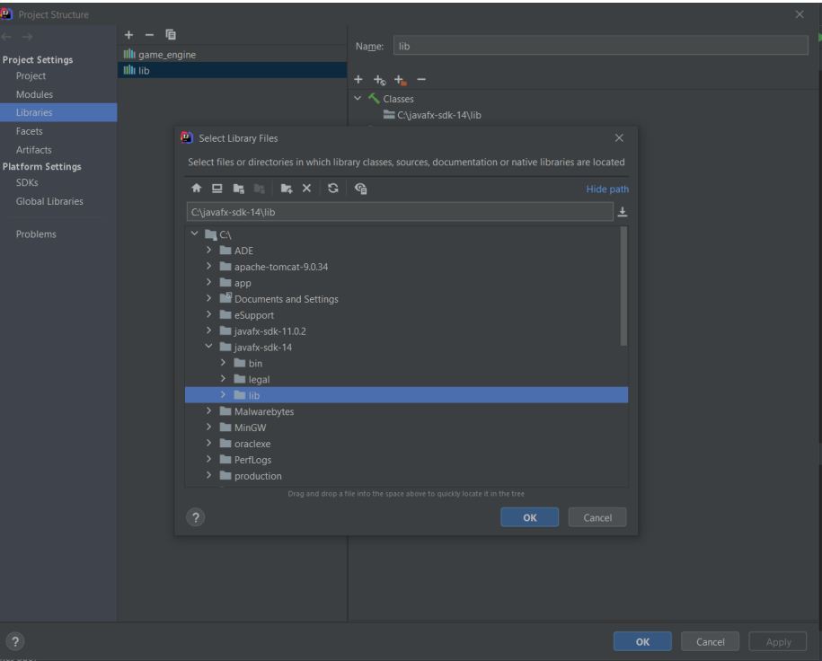
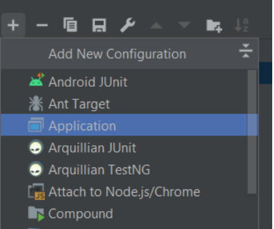

# Quoridor
Quoridor two player game

## Insights

## Setup and install

The JavaFX and Game_Engine is located in the /libraries folder.

1. Add libraries/JavaFX or Download JavaFX SDK https://openjfx.io/openjfx-docs/
2. Add JavaFX SDK to Project libraries
   - -> File -> Project Structures -> Libraries
   - "+" Java
   - Select the downloaded javafx-sdk/lib folder
   

3. Add libraries/game_engine.jar the same way (-> 2.)
4. Create new Run configuration
   - -> Edit configuratins
   
   - Select Main class
   - Add your javaFX-sdk lib path to new VM options with the --module-path flag
   

You successuly setup the project.  
Now you can configure the game parameters in Main.java.

## Players

Built in players: (located in game_engine/game/quoridor/players)
- HumanPlayer
- DummyPlayer
- RandomPlayer
- BlockRandomPlayer

Advanced AI: (located in src/)
- Agent (A* path finding with min-max wall blocking)